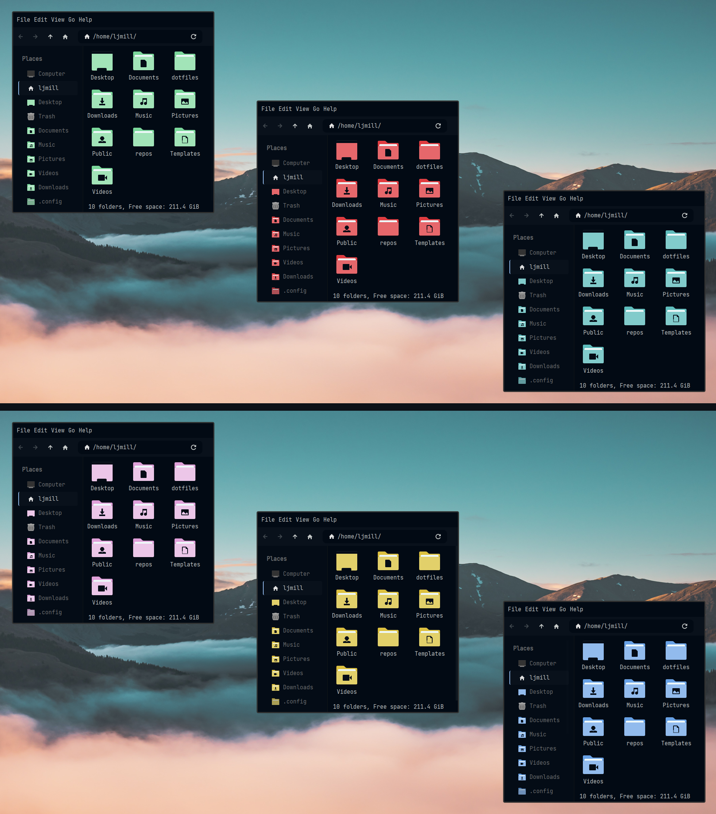

<h1 align="center">
	<br/>
	Articblush Icons</a>
  </h1>

 <h3 align="center">Beautiful icons to match your articblush rice.</h3>
 
 ----



A port of [Artic Blush Colorscheme](https://github.com/articblush) for [Papirus Icon Theme](https://github.com/PapirusDevelopmentTeam/papirus-icon-theme).

## Requirements

Ensure [Papirus Icon Theme](https://github.com/PapirusDevelopmentTeam/papirus-icon-theme) is installed.

## Installation

```sh

# First, clone the repository and change location to the cloned directory:
$ git clone https://github.com/articblush/articblush-icons
cd articblush-icons

# Copy the contents of the src directory to /usr/share/icons/Papirus
sudo cp -r src/* /usr/share/icons/Papirus

# Call the papirus-folders script to set the color of the folders to the desired theme.
./papirus-folders -C [color] --theme [theme]

# Artic Blush color options: articblush-red, articblush-yellow, articblush-green, articblush-blue, articblush-purple, articblush-cyan
# Theme options: Papirus-Dark, Papirus-Light
```

## Applying

Set the `gtk-icon-theme` to the theme the icons were applied to during installation in `~/.config/gtk-3.0/settings.ini` or use a GTK theme manager such as [lxappearance](https://github.com/lxde/lxappearance). 

```ini
gtk-icon-theme-name=Papirus-Dark # or Papirus-Light
```
